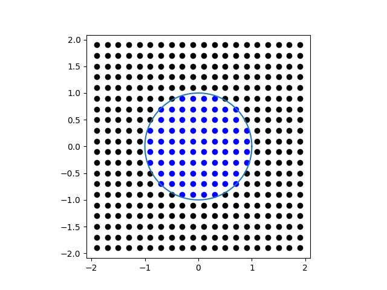

# AreaComputation

Implementa um método para cálculo de áreas de figuras genéricas. Consiste em dividir o plano em um grid e calcular quantos dos retângulos dele possuem centro dentro da figura. Ao saber a quantidade relativa de retangulos, podemos calcular multiplicando esse valor pela área total. O código também gera uma figura ilustrando os resultados. Atualmente, ele aproxima a área do circulo unitário a 3.2 dividindo o retângulo \[-2, 2\] x \[-2, 2] em 20 x 20 quadrados. A figura gerada é mostrada abaixo:

